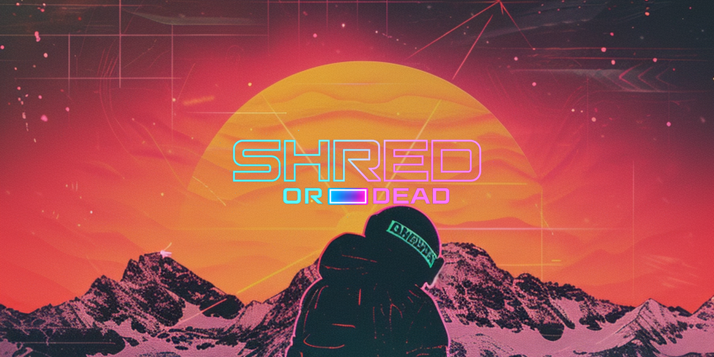

# SHRED OR DEAD

> SkiFree meets synthwave. Carve, trick, and outrun the yeti — or die trying.

  

## [PLAY NOW](https://kingmadellc.github.io/ShredOrDead/)

**Shred or Dead** is a retro snowboarding arcade game built for browser, mobile, and handheld gaming devices. Inspired by the 1991 classic SkiFree, reimagined with a late 80s/early 90s neon aesthetic.

### Features

- **3 game modes** — OG (infinite arcade), Slalom (time trial), Olympics (championship)
- **5 unique map themes** — Classic, Night Run, Backcountry, Blizzard, X Games
- **30+ tricks** — Grabs, flips, spins up to 1440, rail grinds, and combos
- **The Beast** — Crash too much and something wakes up behind you
- **Ski Lodge shops** — Find rare lodges, buy gear and food to boost your run
- **Full controller support** — Keyboard, touch, Xbox, Steam Deck, ROG Ally
- **Procedural terrain** — Every run is different
- **Achievement system** — 20+ achievements to unlock
- **Daily challenges** — One seeded run per day with global competition

### Controls

| Action | Keyboard | Touch | Gamepad |
|--------|----------|-------|---------|
| Steer | ← → | Drag left/right | Left stick |
| Tuck (speed up) | ↑ | Drag up | Left stick up |
| Brake | ↓ | Drag down | Left stick down |
| Jump/Trick | Space | Tap | A button |
| Pause | Escape | Pause button | Start |

### Tech

Pure JavaScript + Canvas 2D. No frameworks, no build step. One HTML file, one JS file.

### License

MIT — fork it, mod it, ship it.
