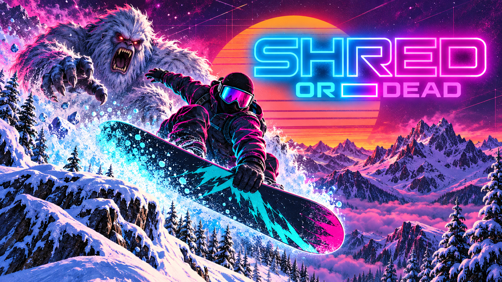

# Shred or Dead

Carve, trick, and outrun the yeti. **Shred or Dead** is a retro snowboarding arcade prototype by King Made, inspired by SkiFree and late-80s neon.

**[Play Shred or Dead](https://kingmadellc.github.io/ShredOrDead/)** · [King Made](https://kingmade.co/games/#shred-or-dead)

[](https://kingmadellc.github.io/ShredOrDead/)

*Illustrated concept key art, 1672 × 941; not a gameplay screenshot. [Full-resolution artwork](docs/media/shred-or-dead-key-art.png).*

## On the mountain

- Three modes: **OG** infinite arcade, **Slalom** time trial, and **Olympics** championship.
- Five themes: Classic, Night Run, Backcountry, Blizzard, and X Games.
- Grabs, flips, spins, rail grinds, and combinations across procedural terrain.
- Ski Lodge shops, gear, food, local achievements, and seeded daily challenges.
- Crash too often and the Beast wakes up behind you.

Progress, settings, and personal bests are stored locally in your browser. High scores, best distance, max combo, and daily records stay on that browser; the public prototype does not connect to a global leaderboard.

## Controls

| Action | Keyboard | Touch | Gamepad |
| --- | --- | --- | --- |
| Steer | Left / Right | Drag left / right | Left stick |
| Tuck | Up | Drag up | Left stick up |
| Brake | Down | Drag down | Left stick down |
| Jump / trick | Space | Tap | A |
| Pause | Escape | Pause button | Start |

Keyboard, touch, and Gamepad API inputs are implemented. Compatibility and performance vary by browser and hardware; specific handheld or controller devices are not certified by this README.

## Run locally

With Git and Python 3 installed:

```sh
git clone https://github.com/kingmadellc/ShredOrDead.git
cd ShredOrDead
python3 -m http.server 8000
```

Open **http://localhost:8000**. There is no build step. For the Node development server, run `npm ci` followed by `npm start`; it serves on **http://localhost:3001**.

## Repository guide

| Path | Purpose |
| --- | --- |
| `game.js` | Canvas 2D game logic, procedural terrain, input, and progression |
| `index.html` | Browser shell and styles |
| `assets/` | Existing game art, sprites, and music |
| `fun-pass/` | Separate experimental variant |
| `docs/media/` | Full-resolution public presentation artwork |

The canonical Play link opens the root build. Experimental variants can differ from the main game.

## License and feedback

[MIT license](LICENSE). Preserve applicable notices when reusing the project.

[Report an issue](https://github.com/kingmadellc/ShredOrDead/issues) with the mode, browser/device, input method, and steps to reproduce.
